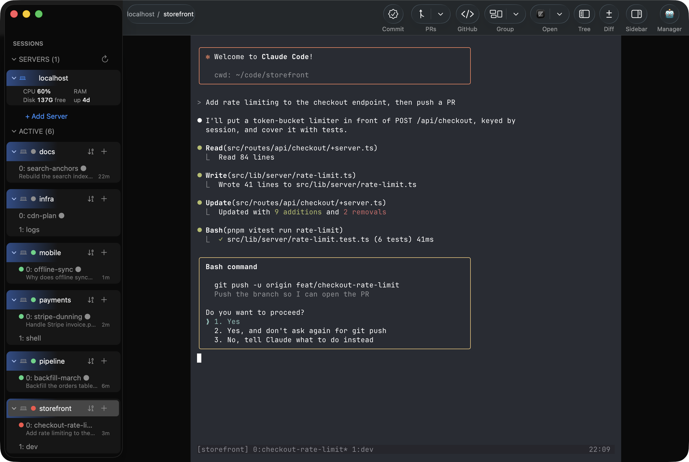
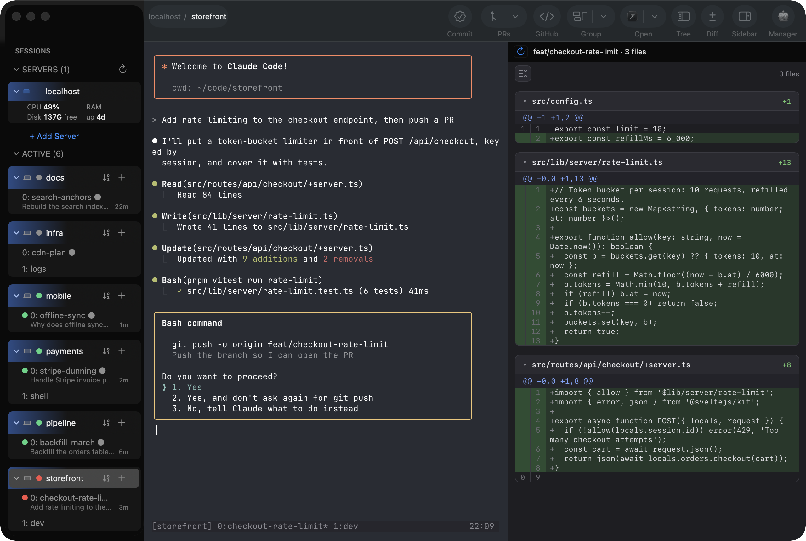

# MuxMaestro

> **Alpha.** It works every day for its author, but expect rough edges and
> breaking changes. Bug reports are very welcome.

A native macOS app for the Claude Code and Codex agents you run in **tmux**.
One window: every host, session, window and pane in a sidebar, with a live
status dot for each agent, and one fast terminal that swaps to whatever you
select.

If you run several agents across tmux sessions (and maybe a few remote boxes),
and you keep hunting with `tmux switch-client` for the one stuck on a permission
prompt, this is for you.



<sub>Screenshots use demo data: a throwaway tmux server with made-up projects.</sub>

## Why

- **Native.** Swift and AppKit, not a web app. Fast and keyboard-driven.
- **A real terminal.** Rendered by **libghostty**, the engine inside
  [Ghostty](https://ghostty.org), embedded directly. No terminal in a web view.
- **tmux-native.** It finds and drives the tmux sessions you already run. You
  don't launch anything through it.
- **Attention first.** Each agent pane has a status dot, read from the agent's
  own state: 🔴 needs you · 🟢 running · ⚪ idle. Each row also shows the last
  prompt you gave that agent and how long ago.

## Features

- **Sidebar + one terminal.** Hosts → sessions → windows → panes on the left.
  Select any row and the terminal switches to exactly that pane.
- **⌘K switcher.** Jump to any session, window or pane by name, or search the
  scrollback of every pane at once.
- **Diff pane.** The selected session's working-tree diff (`git diff HEAD` plus
  untracked files), local or remote.
- **Tree pane.** Browse and search the session's files, preview them, and open
  them in your editor.
- **Commit and pull requests.** Commit from the app, see a session's open PRs,
  and open them on GitHub.
- **Running drawer.** The dev servers and containers your sessions started,
  with their ports.
- **Remote hosts over SSH.** `localhost` plus every `~/.ssh/config` host. Remote
  trees, attach and lifecycle work like local ones, over a reused ControlMaster
  connection. Add a host from the app. It never stores a private key or
  passphrase.
- **Full lifecycle.** New, kill, rename and zoom for sessions, windows and
  panes; tmux-native splits. Destructive actions ask first.
- **The Maestro.** An optional Claude Code agent in a side rail that watches
  your other sessions and tells you which ones need you.
- **Session recovery.** After a reboot, rebuild your tmux sessions and stage
  each agent's resume command.
- **Phone.** A web app for your phone, served by the Mac over your tailnet:
  the thread list, each host's load, and a read-only view of every thread
  (chat or terminal). With "Run Maestro agent" on, it opens on the Maestro:
  what needs you, the review items, and a text box to ask it. Off by default.
- **herdr provider.** If you use [herdr](https://github.com/herdrdev/herdr) (a
  non-tmux workspace manager for agents), its sessions show next to tmux.
  Optional.



## Requirements

- **macOS on Apple Silicon (arm64).** The embedded engine is built for arm64;
  there is no Intel build.
- **[tmux](https://github.com/tmux/tmux)** on every host you want to drive.
- **Xcode 16 or later** (Swift tools 6.0), to build. `make app` uses
  `/Applications/Xcode.app`; set `DEVELOPER_DIR` to use another copy.
- Optional: [Claude Code](https://www.anthropic.com/claude-code) or Codex for
  agent status; an SSH agent (e.g. 1Password's) for remote hosts; **herdr** as a
  second session source.

MuxMaestro shells out to `tmux`, `ssh`, `git`, `scp`, `lsof` and `ps`. It drives
your existing tools; it does not replace them.

### Optional integrations

Each of these is off until the tool or option exists. Without it, the feature is
hidden or falls back.

- **[treehouse](https://github.com/kunchenguid/treehouse)** worktree pools:
  needed by "Start work" and `mux spin`. Without it, `mux spin` exits with an error.
- **tmux window options:** `@mm_prs` (PR numbers) and `@mm_repo` (repo slug) tag
  a window with its PRs; `@tn_base` / `@tn_tags` give it a name plus status tags.
  Without them, PRs come from the window name and `git`.
- **[Tailscale](https://tailscale.com):** needed by the phone app. MuxMaestro ▸
  Setup… ▸ Phone access starts a server on `127.0.0.1` and runs
  `tailscale serve` for it. Only your own tailnet login is answered. Open the
  URL (or scan the QR code) on the phone and add it to the Home Screen.
- **Agent hooks:** Settings can add a hook to `~/.claude/settings.json` and
  `~/.codex/hooks.json` for session recovery. Nothing is written until you click.

## Build and run

There is no prebuilt release yet; you build it yourself. The first step builds
`GhosttyKit.xcframework` from pinned Ghostty source with a project-local Zig
toolchain (no global installs). It takes several minutes the first time, then it
is cached.

```sh
make libghostty        # build the embedded terminal engine (once)
make signing-identity  # optional, once: a stable local signing identity
make app               # build MuxMaestro.app
make install           # build, copy to /Applications, and relaunch
make test              # run the unit tests
```

To sign with your own certificate, put its name in an untracked `local.mk`:
`SIGN_IDENTITY = Apple Development: Your Name (TEAMID)`. The file is gitignored.
The identity's SHA-1 hash, as `security find-identity -v -p codesigning` lists
it, works as `SIGN_IDENTITY` too.

Without `make signing-identity` the app is ad-hoc signed, and macOS asks again
for every permission after each rebuild. The build is not notarized, so on first
launch Gatekeeper asks you to confirm: right-click → Open, or allow it in
System Settings → Privacy & Security.

See [`docs/ARCHITECTURE.md`](docs/ARCHITECTURE.md) for the design and how
libghostty is embedded, and [`docs/BLOCKERS.md`](docs/BLOCKERS.md) for known
gaps.

## Known limitations

- **Apple Silicon only.**
- **Terminal input:** IME composition (CJK) and dead-key sequences (e.g.
  `⌥e e` → `é`) are not fully wired yet. Direct typing, control keys, arrows and
  shortcuts work. See [`docs/BLOCKERS.md`](docs/BLOCKERS.md).
- **No notarized release.** You build it yourself.
- **Opinionated.** It assumes tmux, Claude Code and macOS, and how one person
  works with them.

## Status

An alpha, built milestone by milestone through reviewed PRs into `main`. Every
PR passes CI (build and tests on macOS/arm64) before merge. Issues and PRs are
welcome; it is maintained on a best-effort basis.

## Credits

MuxMaestro stands on other people's work:

- **[Ghostty](https://ghostty.org)** by Mitchell Hashimoto and contributors.
  libghostty renders every terminal in the app.
- **[Pierre](https://pierre.co)**. The Diff pane was designed around
  [`@pierre/diffs`](https://diffs.com), Pierre's diff renderer, and its look
  and interface follow it.
- **[highlight.js](https://highlightjs.org)** for code previews.
- **[WhisperKit](https://github.com/argmaxinc/argmax-oss-swift)** and
  **[FluidAudio](https://github.com/FluidInference/FluidAudio)** for local
  speech.

## License

[MIT](LICENSE). Third-party licenses are in
[`THIRD_PARTY_LICENSES.md`](THIRD_PARTY_LICENSES.md).
